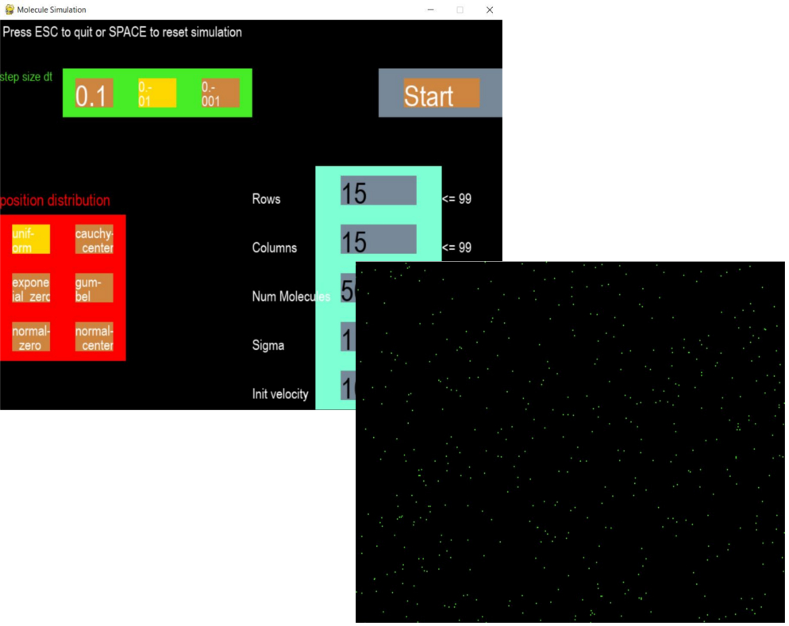

## model_and_simulate

The book *Modellbildung und Simulation: Eine anwendungsorientierte Einführung* contains interesting topics such as
road traffic, scheduling, chaos, and moleculardynamics. 
It describes the modeling and simulation ascpects. But it gives only some implementation ideas, and contains no program code.
To further dive into the simulations, this repo holds implementations
of the presented models in Python with visualization in pygame or with matplotlib. 

The folder src contains individual projects.  All simulations have an individual main method. 
Use the method with *model_and_simulate/main*

### Moleculardynamics (finished)
Moleculardynamics is the implementation of Chapter 13. As model the *Lennard-Jones Potential*
is used to get forces (attraction and repulsion) between all molecules.
The accelerations get calculated by using the *Velocity-Störmer-Verlet* algorithm.
To avoid quadratic runtime scaling, a *Linked-Cells-Datastructure* is implemented.

The simulation has a menu to set parameters such as number of molecules, molecule radius (Sigma), and the Cell grid structure:

Step size dt is the resolution of the algorithm in the numerical solution of the equations of motion.
6 different distributions can be chosen to draw the initial molecule positions from:

### Attractors in Chaos theory (in progress)
Chapter 12 describes chaotic systems and shows simulations as bifurcation diagrams. 
One common attractor is the Lorenz-Attractor (Butterfly effect). The corresponding three-dimensional
system of nonlinear differential equations is not in the book. An implementation with 
*Runge-Kutta* procedure from *scipy.integrate* and *matplotlib* visualization produces a rotatable figure:

Another interesting ode system corresponds to the Aizawa attractor. Formulas, parameters, and initial values come from
[algosome](https://www.algosome.com/articles/aizawa-attractor-chaos.html).
However, the plot does look different:

Maybe there is an error in the equations...

### Microscopic modeling of road traffic (coming next)
Microscopic modeling of road traffic is the implementation of Chapter 8. 

## Acknowledgements
I would like to acknowledge the work of Hans-Joachim Bungartz, Stefan Zimmer and Dirk Pflüger. 
The book *Modellbildung und Simulation: Eine anwendungsorientierte Einführung (eXamen.press)* is very instructive, 
inspiring and understandable. It's really enjoyable to read!

The course **01610** at FernUniversität in Hagen uses the above mentioned book to explain the basics of 
simulations at a university level. The course is very exciting:
[Simulation](https://www.fernuni-hagen.de/mi/studium/module/sim.shtml?sg=bainf)
This repo does not contain any solutions to exercises of the course. 

The Lorenz-Attractor equations are from [wikipedia](https://en.wikipedia.org/wiki/Lorenz_system):
Lorenz, Edward Norton (1963). "Deterministic nonperiodic flow". Journal of the Atmospheric Sciences. 20 (2): 130–141. 

The Aizawa-Attractor equations are from [algosome](https://www.algosome.com/articles/aizawa-attractor-chaos.html):
Langford, William Finlay (1984). "NumericalStudies of Torus Bifurcations". 
International Series of Numerical Mathematics. 70: 285–295.

I searched [looperman](https://www.looperman.com/loops) to get some fancy music loops for pygame.
I would like to thank Rasputin(Brisk Bass Sequence, Goa Trance Gated Vox), SUPERSAMPLE(KORG 2),
and soaren(Temptation Playground Trippy Bells).
Some sound effects were taken from [freesound](https://freesound.org). Thanks to michael_kur95(Hit02),
Leszek_Szary(jumping), Tissman(hit3). The sounds are under CC0 1.0 Universal license.

